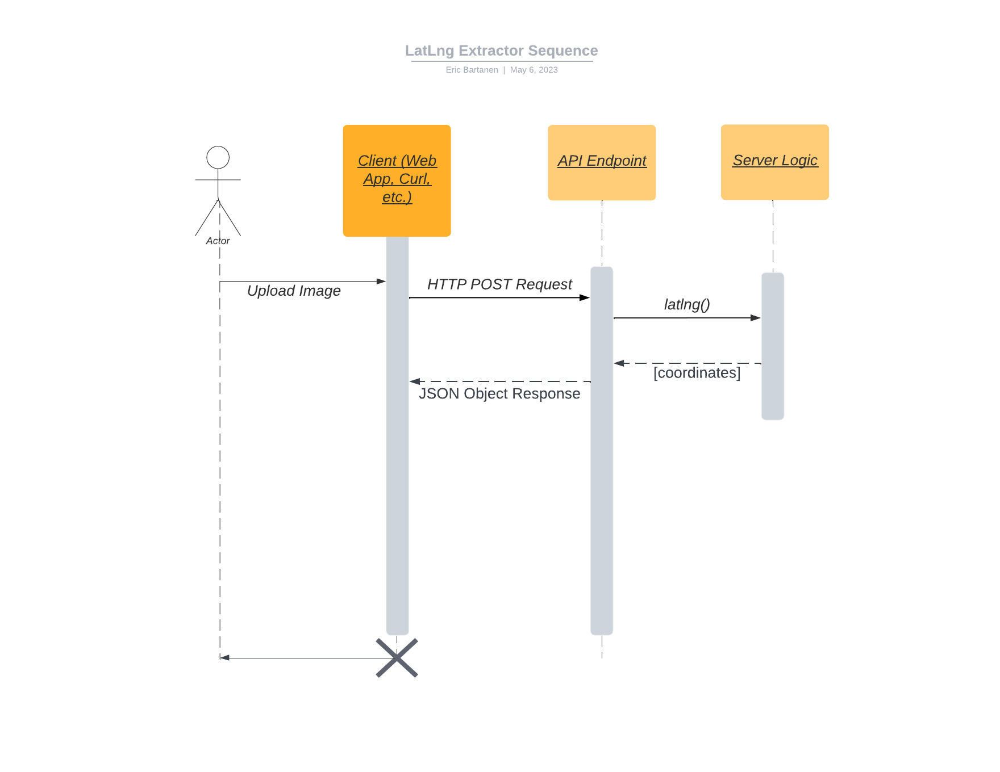

# LatLng Extractor REST API

This API take an image and returns a JSON object with the Latitude Reference, Latitude Coordinates, Longitude Reference, and Longitude Coordinates. All coordinates are in Decimal, Minute, Second (DMS) format. 

If a photo does not contain GPS data then an empty array will be returned. 

*Note: anything in angle brackets (<>) indicates user input

## Making the Request   

You need to make an HTTP POST request passing the image binary to the API endpoint: http://34.19.83.191:3003/latlng/

Feel free to use the image sample_exif.jpg from this repository for testing.

### Curl Example (Linux)

curl -k -X POST -F 'image=@\<<i>absolute path to image</i>>' http://34.19.83.191:3003/latlng/

### Python Request Example

import requests  
url = "http://34.19.83.191:3003/latlng/"  
files = {'image': (  
    '<<i>image file</i>>',  
    open('<<i>image file</i>>', 'rb'),  
    'multipart/form-data',  
    )} 
r = requests.post(url, files=files)  

## Receiving the Response

The API request will return a JSON object with the following format:

Schema: 

[ 
{'GPSLatitudeRef': \<STR: cardinal direction, N or S>},  
{'GPSLatitude': \<TUPLE: showing Decimal, Minute, Second>},  
{'GPSLongitudeRef': \<STR: cardinal direction, W or E>},  
{'GPSLongitude': \<TUPLE: showing Decimal, Minute, Second>} 
] 

Example:  

[  
{'GPSLatitudeRef': N},  
{'GPSLatitude': [57.0, 25.0, 52.64]},  
{'GPSLongitudeRef': 'W'},  
{'GPSLongitude': [110.0, 34.0, 45.1]} 
]
  

## UML Sequence Diagram

